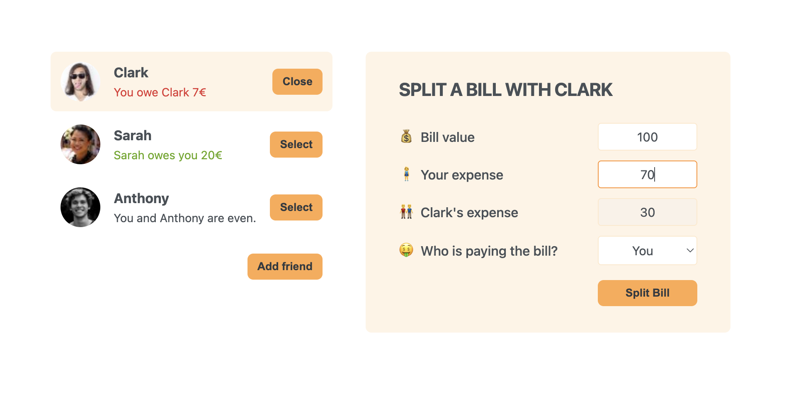

# 🍽️ Eat-n-Split 
Eat-n-Split is a fun React app that lets you manage shared expenses between friends. Add friends, select who you're splitting the bill with, and track how much everyone owes or is owed.

⚠️ Note: The CSS styling used in this project is not custom-made; it's part of the course I’m following. Profile pictures are randomly fetched from https://i.pravatar.cc and used for learning purposes only.


## 📷 Preview


## ✨ Features
- Add friends to the list
- Select a friend to split a bill
- Adjust balances dynamically
- Visual indication of who owes what
- Toggle form visibility with buttons

## 🧠 Concepts Practiced
- useState for managing component state
- Updating arrays and objects immutably
- Conditional rendering (toggling forms and selection)
- Passing event handlers as props
- Component structure and state lifting

## 🚀 Getting Started

Clone the repository:
```bash
git clone https://github.com/mfa1zan/eat-n-split.git
cd eat-n-split
```

Install dependencies:
```bash
npm install
```

Run the development server:
```bash
npm start
```


